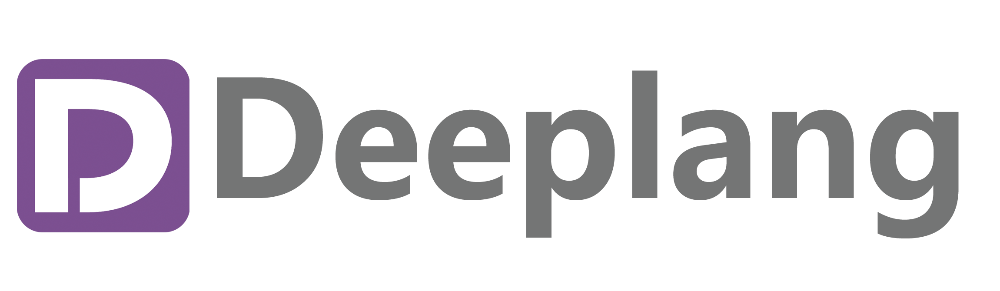

# Deeplang

Deeplang语言是一种自制编程语言，由来自浙大、中科大、帝国理工等高校的学生共同完成。

Deeplang致力于成为一门具有鲜明内存安全特性的面向IoT场景的语言，设计过程中参考Rust的安全机制，但又根据IoT场景的特性选择了更合适的解释执行模式。Deeplang是一种静态类型、强类型语言，参考C-style设计语法，同时支持过程式、逻辑式和函数式的混合范式。

Deeplang目前正处于持续的开发和迭代中。

Deeplang的核心特性之一是它的内存管理系统。
Deeplang的内存管理系统由三部分组成：

- 一些类型可以任意复制，这些类型被称为“值类型”，使用不受限制
- 不能随意复制的类型，可以采用类似Rust语言的所有权+借用的机制进行管理
- Deeplang还提供内建的引用计数支持，并计划使用Koka语言中的Perceus技术优化引用计数的性能

项目主页：<https://deeplang.org/>

代码仓库：<http://github.com/deeplang-org/deeplang>
